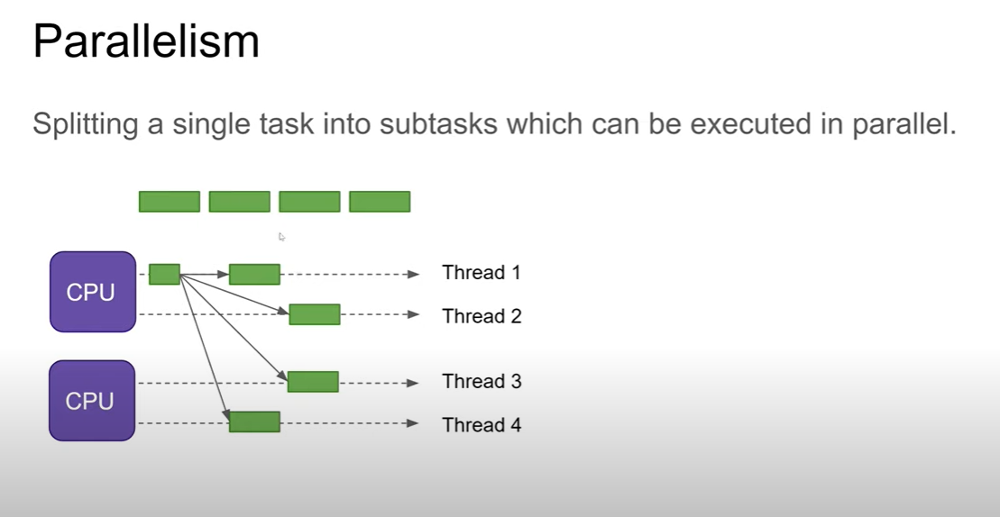
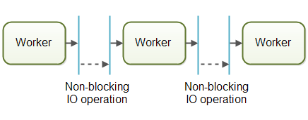

### 1. stages of a thread in java  

&#8194;&#8194; 

    

   
&#8194;&#8194;  

### 2. Difference between multitasks and multithreading and parallelism and parallelism

**parallel execution**: *multiple programs* being run at the same time,  although they **are** really running "at the same time" though. like using several cpu or cpu cores running different programs. 

**parallelism** :  

    

**Multitasks**: *multiple programs* being run at the same time,  although they **are not** really running "at the same time" though. The single CPU was shared between the programs. Unlike multithreading, In multitasking, the processes share separate memory and resources.

**Multithreading**: one program executes multiple *threads*  Unlike multitasking, multithreading provides the same memory and resources to the processes for execution.

### 3. Two kinds of concurrency model  

**shared state concurrency model**: multiple threads executing within the same application would also share objects  

**seperate state concurrency model**: threads do not share any objects or data. This avoids a lot of the concurrent access problems of the shared state concurrency model.

### 4. how parallel assembly line works：

    

   

Each worker is running in its own thread, and shares no state with other workers. This is also sometimes referred to as a shared nothing concurrency model.Systems using the assembly line concurrency model are usually designed to use non-blocking IO. Non-blocking IO means that when a worker starts an IO operation (e.g. reading a file or data from a network connection) the worker does not wait for the IO call to finish. worker gives up the control of a job when IO starts, When the IO operation finishes, the result of the IO operation ( e.g. data read or status of data written) is passed on to another worker.  

    

   

Systems using an assembly line concurrency model are also sometimes called reactive systems, or event driven systems. The system's workers react to events occurring in the system, either received from the outside world or emitted by other workers. Examples of events could be an incoming HTTP request, or that a certain file finished loading into memory etc.  

### 5. Some details about thread implementation  

1. There are two ways of implementing multi-threading: 

   - Implement a interface called 'Runnable' and overwirte the function called 'run'
   - Build a subclass of 'Thread', overrun its function 'run'

2. If you want a new thread to run its 'run' function instead of running it in your current thread, Don't use 'run' function directly, use 'start'.

### 6. race conditions:  

race conditions only refer to the condition that several threads **operate/ upgrade** the same resouce. If two threads are only **accessing or reading** the same 
