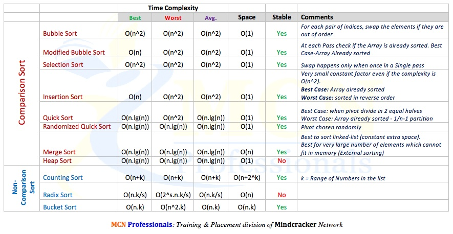

1. Two kinds of sorting algorithm, first is internal sorting algorith which will put all the data into meemory, this kind of sorting fit small set. External sort is for large dataset.
2. There are several types of internal sorting algorithm: (1) Insertion: naive insertion and Hill (2) Selection: naive insertion and Heap (3) swap: bubble and quick sort
3. 时间频度：T(n) how many times a linemeaning we only say O(N) not T(N+CONSTANT); say 
   O(N* 2) not O(CONSTANT*N* 2)
4.  Commonly use O expression:(listed from better to worse)
   - O(1)
   - O(logn): the most intuitive algorith that uses this O complexity is binary search
   - O(n): one layer of loop
   - O(nlogn): one layer of loop, with a log complexity operation inside the loop
   - O(n^2,3,...): n layers of loop
   - O(2^n)
   - O(n!)
6. Comparison between different sorting algorithms:  

    

   
&#8194;&#8194;   

7. 